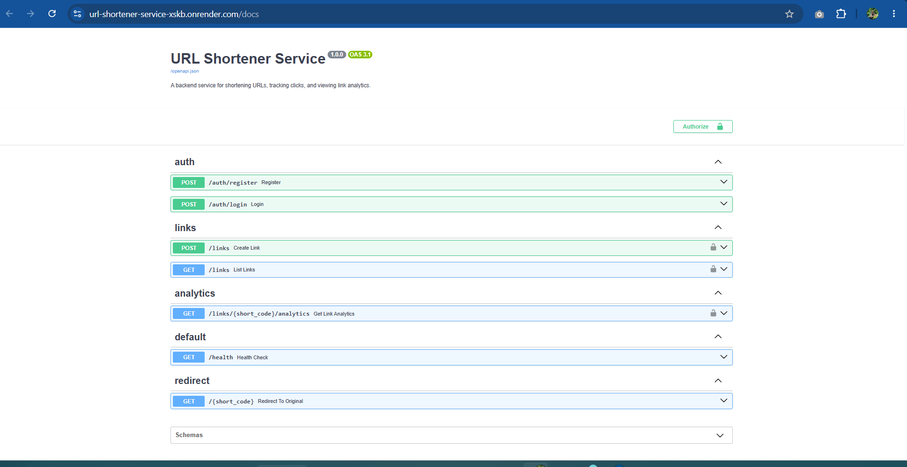

# URL Shortener Service

A backend service for shortening URLs, tracking clicks, and viewing link analytics — built with FastAPI, PostgreSQL, and Redis. Includes JWT authentication, rate limiting, and full test coverage.

**Live demo:** https://url-shortener-service-xskb.onrender.com/docs

> Note: the live demo runs on a free instance that spins down after 15 minutes of inactivity. The first request after idle time may take 30-60 seconds to respond.

## Table of Contents
- [Features](#features)
- [Tech Stack](#tech-stack)
- [Architecture](#architecture)
- [Getting Started](#getting-started)
- [API Reference](#api-reference)
- [Testing](#testing)
- [Deployment](#deployment)
- [Screenshots](#screenshots)
- [License](#license)

## Features
- User registration and login with JWT authentication
- Password hashing with bcrypt
- Shorten any URL into a unique 6-character code
- Redirect from short code to original URL with click tracking
- Per-link analytics (total clicks, creation/expiry dates)
- Optional link expiry dates
- Paginated link listing, scoped to the logged-in user
- Rate limiting on auth endpoints (5 requests/minute)
- Redis caching layer for fast redirects
- Fully dockerized with Docker Compose (API + Postgres + Redis)
- Automated tests (14 tests, isolated test database)
- Linted with Ruff
- CI pipeline via GitHub Actions (lint, test, build)
- Branded Swagger docs with custom favicon
- OpenAPI spec exportable for Postman/Insomnia

## Tech Stack
| Layer          | Technology                     |
|----------------|---------------------------------|
| Framework      | FastAPI                        |
| Database       | PostgreSQL (via Neon in production) |
| ORM            | SQLAlchemy                     |
| Migrations     | Alembic                        |
| Validation     | Pydantic                       |
| Auth           | JWT (python-jose), bcrypt (passlib) |
| Caching        | Redis                          |
| Testing        | Pytest, httpx                  |
| Linting        | Ruff                           |
| Containerization | Docker, Docker Compose        |
| CI/CD          | GitHub Actions                 |
| Deployment     | Render                         |

## Architecture

\`\`\`mermaid
flowchart TD
    Client[Client / Browser]
    API[FastAPI App]
    Auth[Auth Router]
    Links[Links Router]
    Redirect[Redirect Router]
    Analytics[Analytics Router]
    DB[(PostgreSQL / Neon)]
    Cache[(Redis)]

    Client -->|HTTP requests| API
    API --> Auth
    API --> Links
    API --> Redirect
    API --> Analytics

    Auth --> DB
    Links --> DB
    Analytics --> DB
    Redirect --> DB
    Redirect --> Cache

    Auth -.->|JWT issued/verified| Client
\`\`\`

**Request flow example — shortening and visiting a link:**
1. Client registers and logs in, receiving a JWT
2. Client sends `POST /links` with a long URL (JWT required)
3. API generates a unique short code, stores the mapping in PostgreSQL
4. Anyone visits `GET /{short_code}`
5. API looks up the original URL and logs a click, then redirects
6. Client owner can call `GET /links/{short_code}/analytics` to view click stats

## Getting Started

### Prerequisites
- Python 3.12+
- Docker and Docker Compose
- A PostgreSQL database (local via Docker, or a hosted instance like Neon)

### Local Setup

1. Clone the repository
\`\`\`bash
git clone https://github.com/davidtiger3622/url-shortener-service.git
cd url-shortener-service
\`\`\`

2. Create a virtual environment and install dependencies
\`\`\`bash
python3 -m venv venv
source venv/bin/activate
pip install -r requirements.txt
\`\`\`

3. Copy the example environment file and fill in real values
\`\`\`bash
cp .env.example .env
\`\`\`

4. Start Postgres and Redis via Docker Compose
\`\`\`bash
docker-compose up -d db redis
\`\`\`

5. Run database migrations
\`\`\`bash
alembic upgrade head
\`\`\`

6. Start the development server
\`\`\`bash
uvicorn app.main:app --reload
\`\`\`

7. Visit the interactive docs at `http://localhost:8000/docs`

### Running with Docker Compose (full stack)
\`\`\`bash
docker-compose up --build
\`\`\`

## API Reference

Full interactive documentation is available at `/docs` (Swagger UI) once the server is running. The OpenAPI spec is also exported as [`openapi.json`](./openapi.json) for import into Postman or Insomnia.

### Auth
| Method | Endpoint | Description | Auth required |
|--------|----------|-------------|----------------|
| POST | `/auth/register` | Create a new user account | No |
| POST | `/auth/login` | Log in and receive a JWT | No |

### Links
| Method | Endpoint | Description | Auth required |
|--------|----------|-------------|----------------|
| POST | `/links` | Shorten a new URL | Yes |
| GET | `/links` | List your links (paginated) | Yes |

### Analytics
| Method | Endpoint | Description | Auth required |
|--------|----------|-------------|----------------|
| GET | `/links/{short_code}/analytics` | View click analytics for a link | Yes |

### Redirect
| Method | Endpoint | Description | Auth required |
|--------|----------|-------------|----------------|
| GET | `/{short_code}` | Redirect to the original URL | No |

### Health
| Method | Endpoint | Description | Auth required |
|--------|----------|-------------|----------------|
| GET | `/health` | Health check | No |

## Testing

Run the full test suite (14 tests, isolated test database):
\`\`\`bash
pytest -v
\`\`\`

Run linting:
\`\`\`bash
ruff check .
\`\`\`

Both are run automatically in CI on every push via GitHub Actions.

## Deployment

This service is deployed on [Render](https://render.com) using Docker, with:
- **Database:** [Neon](https://neon.tech) (serverless PostgreSQL)
- **Cache:** Render Key Value (Redis-compatible)

Deployment configuration is defined in [`render.yaml`](./render.yaml).

## Screenshots

**Branded Swagger docs:**

## License

This project is licensed under the MIT License — see the [LICENSE](./LICENSE) file for details.
